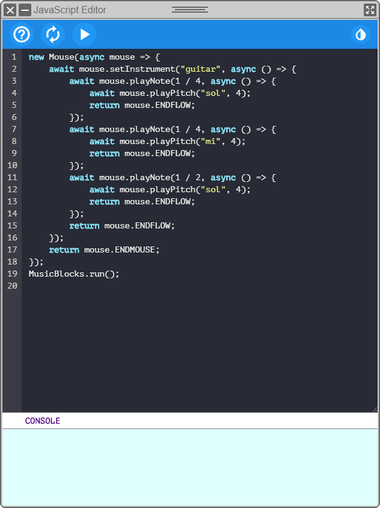
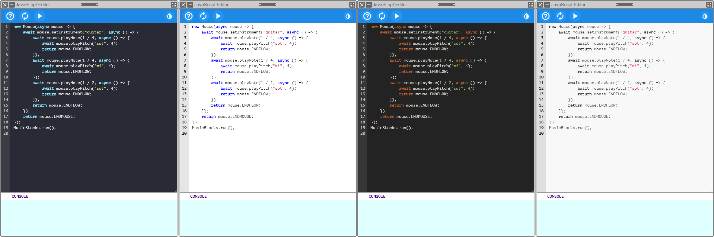
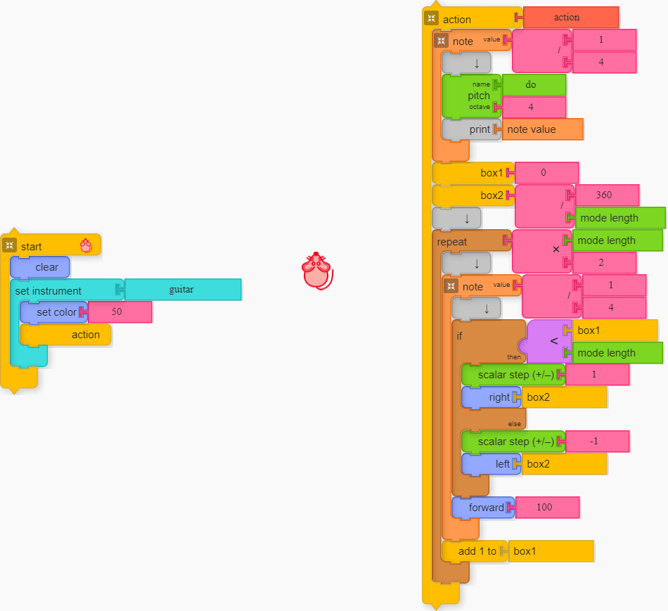
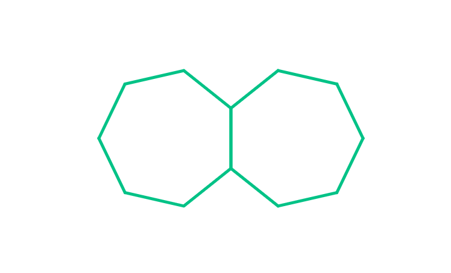

# Music Blocks JavaScript Export

This is a description of my work on
[Music Blocks JavaScript Export](https://summerofcode.withgoogle.com/projects/#5876019535282176)
during *Google Summer of Code 2020* with
[Sugar Labs](https://github.com/sugarlabs/). This repository contains my
[original authored files](./original-authored-files/), samples of my work, and
examples. The *exported* code syntax *guide* and *API* is present in
[original-authored-files/js-export/samples/sample.js](./original-authored-files/js-export/samples/sample.js).
</br>

## Abstract

The aim of *Music Blocks* is to teach beginners how to program, using a
snap-together block-based instructions to create music. The purpose of my
project is **to develop a framework to export any Music Blocks program to an equivalent JavaScript code, and/or write Music Blocks programs using JavaScript, either of which can run independently of the blocks**.
</br>

## Tech Stack

I've used **JavaScript** upto the **ECMAScript 8 (2017)** specification widely
relying on *ES6* `classes`, `let`/`const`, `arrow functions`, `promises`, and
finally, `async`/`await` syntactical feature from *ES8*. In the implementation
of a new *Music Blocks* widget - *JavaScript Editor*, I required the use of
**HTML** and **CSS**, but I used the *DOM* manipulation features of JavaScript
to handle those.

In addition, for the actual code generation part of the project, I relied on a
library named **[Astring](https://github.com/davidbonnet/astring)**
(*MIT License*), which is a "*Tiny and fast JavaScript code generator from an ESTree-compliant AST*".
I generated *Abstact Syntax Trees* (*AST*s) based on the **ESTree ES2017**
specification, which I serialized to *ES8 JavaScript* code using the library.

Finally, I relied on a library named **[CodeJar](https://github.com/antonmedv/codejar)**
(*MIT License*), which is "*an embeddable code editor for the browser*". I used
it to create a text editor inside my widget, and a styling library named
**[Highlight.js](https://github.com/highlightjs/highlight.js/)**
(*BSD-3-Clause License*) for syntax highlighting.

</br>

## Work Progression

During the *community bonding period* I started with refactoring some of the
crucial files to *ES6* standard: completed refactoring `var` to `let` and
`const`, implementing `arrow` functions, and refactoring `function prototype`
syntax to *ES6* `classes`.

Even though my project was an independent feature addition, it was imperative
that I refactored and reorganised the different components of *Music Blocks*
under the hood. Therefore, I progressed in small steps splitting the task across
multiple PRs. Throughout the three months of the *coding period* (post release
[v3.1](https://github.com/sugarlabs/musicblocks/releases/tag/v3.1)), I have
**51 merged Pull Requests** ([copy of PRs](https://github.com/meganindya/musicblocks/pulls?q=label%3A%22GSoC+2020%22+)) across **240 commits**.

My work, basically, consisted of four major parts:
**Restructuring the components**, **Building the JavaScript coding framework**,
**Generating code from block stacks**, and **Building the JavaScript Code Editor**.
Since, the restructuring was not possible to do linearly, I did it in multiple
turns.

### Restructuring the components

When I started, `logo.js` was somewhat monolithic, consisting of code that was
part of different components. As I progressed, I created two new components:
`Painter` and `Singer`, in two new files `turtle-painter.js` and
`turtle-singer.js`, respectively. These two components are now subcomponents of
the `Turtle` component in `turtle.js`. `Painter` contains code related to the
"*art*" generated by the *turtle* (*mouse*), while the `Singer` deals with
"*music*" generation. The `Turtles` component was separated to a new file named
`turtles.js`, which now totally oversees alone all `Turtle` objects.

Below listed are the major contributions related to restructing and refactoring
the said components.

- **`logo.js`**

  | PR(s) | Description |
  | :---: | ----------- |
  | [2295](https://github.com/sugarlabs/musicblocks/pull/2295) | Ported out code related to processing *notes* to `js/note.js`, encapsulating those in a new `class` named `NoteController`. |
  | [2298](https://github.com/sugarlabs/musicblocks/pull/2298) | Converted the `function prototype` definition of `Logo` to *ES6* `class` and added *ES6* `getters` and `setters` for instance variables. |
  | [2356](https://github.com/sugarlabs/musicblocks/pull/2356) | Ported out code related to *notations* to `js/notation.js`, encapsulating those in a new `class` named `Notation`. |
  | [2357](https://github.com/sugarlabs/musicblocks/pull/2357) | Ported out utilities related to mathematical calculations to `js/utils/mathutils.js`, encapsulating those in a new `class` named `MathUtility`. |
  | [2358](https://github.com/sugarlabs/musicblocks/pull/2358) | Ported out some functions related to *blocks* to `js/blocks.js`. |
  | [2393](https://github.com/sugarlabs/musicblocks/pull/2393) | Reorganized and renamed members, and cleaned up code. |
  | [2407](https://github.com/sugarlabs/musicblocks/pull/2407) | Ported out utility functions related to music logic to `Singer` (`note.js` was rebranded as `turtle-singer.js`, and `NoteController` as `Singer`) in `turtle-singer.js` |
  | [2408](https://github.com/sugarlabs/musicblocks/pull/2408), [2418](https://github.com/sugarlabs/musicblocks/pull/2408), [2425](https://github.com/sugarlabs/musicblocks/pull/2425), [2432](https://github.com/sugarlabs/musicblocks/pull/2432) | Ported out variables related to music *state* to `Turtle`/`Singer`. |

- **`turtle.js`**

  | PR | Description |
  | :-: | ----------- |
  | [2304](https://github.com/sugarlabs/musicblocks/pull/2304) | Reorganized and renamed members, and cleaned up code. |
  | [2312](https://github.com/sugarlabs/musicblocks/pull/2312) | Set up the **Model-View-Controller (MVC)** framework for the `Turtle` component. |
  | [2316](https://github.com/sugarlabs/musicblocks/pull/2312) | Reworked variable access. |

- **`turtles.js`**

  | PR(s) | Description |
  | :---: | ----------- |
  | [2309](https://github.com/sugarlabs/musicblocks/pull/2309) | Separated the `Turtles` component from `turtle.js` to `turtles.js` and set up the **Model-View-Controller (MVC)** framework for it. |
  | [2313](https://github.com/sugarlabs/musicblocks/pull/2313), [2341](https://github.com/sugarlabs/musicblocks/pull/2341) | Removed deprecated code and reworked variable access. |
  | [2384](https://github.com/sugarlabs/musicblocks/pull/2374) | Improved modularity. |

- **`turtle-painter.js`**

  | PR | Description |
  | :-: | ----------- |
  | [2382](https://github.com/sugarlabs/musicblocks/pull/2382) | Created `Turtle`'s subcomponent `Painter` in `turtle-painter.js`. |

- **`turtle-singer.js`**

  | PR | Description |
  | :-: | ----------- |
  | [2397](https://github.com/sugarlabs/musicblocks/pull/2397) | Rebranded `note.js` to `turtle-singer.js`, and `NoteController` component `class` to `Singer`. |

</br>

### Building the JavaScript coding Framework

I created a *framework* to setup the *JavaScript-based Music Blocks* programs.
All the code related to the framework's operation is now present in the
`js/js-export/` directory. The framework consists of an **API** of `methods`
corresponding to different *blocks*' instructions. I conceptualized a standard
syntax, based on which the JavaScript programs are to be written in.

The `export.js` contains two components: `Mouse` and `MusicBlocks`. `Mouse` is
an encapsulation for the `Turtle` component, while `MusicBlocks` deals with all
operational behavior of the framework. Since, Music Blocks (`Logo` component)
programs heavily rely on asynchronous `events` like `setTimeout`, it was a big
challenge to come up with a mechanism to present a synchronous appearance in the
*exported* code. Beneath the hood, the framework heavily relies on *ES6*
`promises`. I used the *syntactic sugar* of *ES8* `async`/`await` to cover up
the `.then()` chaining of `promises`. In the end, the code looks quite
synchronous and clean.

Yet more refactoring was required to connect the API ends to their behavior.
Most of the *block behavior* was present in the `block API` in the `js/blocks/`
directory. The behavior related to "*art*" generation is present in the
`Painter` component with `methods` for each. The "*music*" behavior had to be
extracted out. I created a new directory `js/turtleactions/`, and separated out
the *behavior* code from the *block* code. Each of the "music" palettes now have
their own *action* file which deals with their behavior, a method each for each
block. Finally, I created a directory `js/js-export/API/`, having files
corresponding to each *palette*; each file contains `methods` that are to be
used in the *exported* code, which are internally linked to corresponding
*behavior* methods in `js/turtleactions/`.

Below listed are the major contributions related to the said work.

| PR | Description |
| :-: | ----------- |
| [2380](https://github.com/sugarlabs/musicblocks/pull/2380) | Conceptualized the "framework" and testedfor *Graphics* and *Pen* palette blocks. |
| [2497](https://github.com/sugarlabs/musicblocks/pull/2497) | Ported code related to behavior of*Rhythm* blocks. |
| [2536](https://github.com/sugarlabs/musicblocks/pull/2536) | Ported code related to behavior of *Meter*blocks. |
| [2454](https://github.com/sugarlabs/musicblocks/pull/2454) | Ported code related to behavior of *Pitch*blocks. |
| [2504](https://github.com/sugarlabs/musicblocks/pull/2504) | Ported code related to behavior of*Intervals* blocks. |
| [2480](https://github.com/sugarlabs/musicblocks/pull/2480) | Ported code related to behavior of *Tone*blocks. |
| [2471](https://github.com/sugarlabs/musicblocks/pull/2471) | Ported code related to behavior of*Ornament* blocks. |
| [2476](https://github.com/sugarlabs/musicblocks/pull/2474) | Ported code related to behavior of*Volume* blocks. |
| [2477](https://github.com/sugarlabs/musicblocks/pull/2477) | Ported code related to behavior of *Drum*blocks. |
| [2508](https://github.com/sugarlabs/musicblocks/pull/2508) | Created the API files. |
| [2511](https://github.com/sugarlabs/musicblocks/pull/2511) | Set up the timing of events. |
| [2547](https://github.com/sugarlabs/musicblocks/pull/2547) | Add argument validation. |

</br>

### Generating code from block stacks

I used a library called **`Astring`** to generate required *exported* JavaScript
code. The library takes `ESTree`-spec **Abstract Syntax Trees** (**ASTs**) as
input. Therefore, my work was to generate the *ASTs* from the block stacks.
Internally, *Music Blocks* maintains a linear list of `Block` objects which are
linked amongst themselves via their indices in the list. Since, handing the
nesting of the stacks in that manner would have been a difficult process, I
generated a *non-linear tree-like* recursive data-structure by parsing the
*start* and *action* block stacks. The arguments to blocks can get chained
horizontally, and so, the structure had to deal with that too.

After the non-linear data-structure generation was handled, I mechanised an
algorithm to *parse that recursive structure* to generate a recursive `JSON`
object representing the *Abstract Syntax Tree* in the `ESTree` `ES2017`
specification. The code could then be generated by the `generate()` function of
the `Astring` library.

All the code related to the data-structure and code generation is in
`generate.js`, encapsulated in the `JSGenerate` class. All the utilities related
to generation of the *ASTs* are in `ASTutils.js`, encapsulated in the `ASTUtils`
class. `JSInterface` in `interface.js` contains lists and lookups of `Block`
names and *API* `methods`', `getters`', and `setters`' names. It also contains
the utilities related to the API's *argument validation*.

Below listed is the Pull Request related to the code generation.

| PR | Description |
| :-: | ----------- |
| [2525](https://github.com/sugarlabs/musicblocks/pull/2525) | Added the mechanism to generate the tree-like data-structure, AST from it, and the final code. |

</br>

### Building the JavaScript Code Editor

I created a new widget named **JavaScript Editor** which has a *syntax-highlighted*
`text-box` and a `console` to print messages during execution. The widget is
generated by using the `DOM` manipulation features of JavaScript. The widget
deals with displaying the generated code, editing/writing new code, and running
the JavaScript-based Music Blocks programs. The styling of the editor is done
via the use of a library named **`Highlight.js`**.

Below listed are the contributions related to the JavaScript Editor Widget.

| PR | Description |
| :-: | ----------- |
| [2489](https://github.com/sugarlabs/musicblocks/pull/2489) | Built the initial widget design. |
| [2514](https://github.com/sugarlabs/musicblocks/pull/2514) | Add robustness features and failsafes mechanisms related to multiple *Mice* (*Mouse* objects). |
| [2547](https://github.com/sugarlabs/musicblocks/pull/2547) | Enhance the editor. |

</br>

## Demo

The **JavaScript Widget** looks like:



The `?` button displays the *help* and *guide* about the syntax, the `↻` button
*regenerates* (for changes made in block stacks) the code, and the `▶` button
*executes* (runs) the code. The button `💧` button changes the style. The editor
supports **four styles** (themes): *dark high-contrast* (`dracula`), *light low-contrast*
(`github`), *dark high-contrast* (`railcasts`), *light high-contrast*
(`visual studio`).



For an example [project](./assets/traverse-mode-up-down.html),



the *code* generated is

```
let action = async mouse => {
    await mouse.playNote(1 / 4, async () => {
        await mouse.playPitch("do", 5);
        await mouse.print(mouse.NOTEVALUE);
        return mouse.ENDFLOW;
    });
    let box1 = 0;
    let box2 = 360 / mouse.MODELENGTH;
    for (let i0 = 0; i0 < mouse.MODELENGTH * 2; i0++) {
        await mouse.playNote(1 / 4, async () => {
            if (box1 < mouse.MODELENGTH) {
                await mouse.stepPitch(1);
                await mouse.turnRight(box2);
            } else {
                await mouse.stepPitch(-1);
                await mouse.turnLeft(box2);
            }
            await mouse.goForward(100);
            return mouse.ENDFLOW;
        });
        box1 = box1 + 1;
    }
    return mouse.ENDFLOW;
};
new Mouse(async mouse => {
    await mouse.clear();
    await mouse.setInstrument("guitar", async () => {
        await mouse.setColor(50);
        await action(mouse);
        return mouse.ENDFLOW;
    });
    return mouse.ENDMOUSE;
});
MusicBlocks.run();
```

which when *run* (by clicking on the `▶` button on the editor), plays
[audio](./assets/traverse-mode-up-down.oga) and draws


## Possible Enhancements

- Add **load**/**save** mechanism in the *JavaScript Editor*.

- Add support for **Heap** (create a `stack` data-structure), **Media**,
**Sensors**, and **Ensemble** blocks.

- Implement a mechanism to *stop* the running code.

- `ADVANCED` &nbsp; Preprocess the generated/written code to insert `async`/
`await`, `return ENDFLOW`, `return ENDMOUSE`, so that the user-end code can be
even neater.

- `ADVANCED` &nbsp; Preprocess the generated/written code to surround the
`await` statements in `try catch` blocks, so that `Uncaught (in promise)` errors
can be handled.

- `ADVANCED` &nbsp; Redirect *console* behavior in the *JavaScript Widget*'s
*console*.

- `ADVANCED` &nbsp; Separate the music generation components of the
*Music Blocks codebase* such that *JavaScript-based programs* can be written and
executed locally from one single `HTML` (or some *executable*) file, i.e. there
would only be the *canvas* and the *editor* in that GUI.
